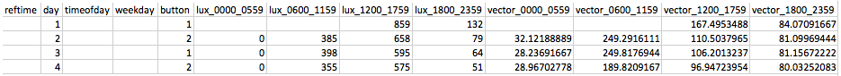

Geneactiv Summary
=========
[](https://ncfcode.rc.fas.harvard.edu/phoenix/geneactiv_summary/commits/master)

Geneactiv Summary pipeline produces summary values (6 hr epoc) of light (lux), vector magnitudes (vector), and button presses (button)

## Preview

##### SUBJECT123_Geneactivwrist_day1to4.csv



## Table of contents
1. [Requirements](#requirements)
2. [Usage examples](#usage-examples)

### Requirements

To run Geneactiv Summary pipeline, users may choose one of the following options:

##### Option 1 - Installation

To install Geneactiv Summary on your system, run the following commands:
```bash
git clone git@ncfcode.rc.fas.harvard.edu:phoenix/geneactiv_summary .
cd geneactiv_summary
pip install -r requirements.txt
```

##### Option 2 - Module Load (Within NCF only)

To load Geneactiv Summary module on NCF without an installation:
```bash
module load miniconda2/3.19.0
module load geneactiv_summary/master-ncf
```
### Usage examples

```bash
# To generate reports under every subject's processed directory in PHOENIX
geneactiv_summary.py

# To generate reports for every subject and save them in ~/dp_test1 directory
geneactiv_summary.py --output-dir ~/dp_test1
# or
geneactiv_summary.py --output-dir ~/dp_test1/

# To generate reports for STUDY_A's subject B under ~/dp_test1 directory
geneactiv_summary.py --output-dir ~/dp_test1/ --study STUDY_A --subject B

# To generate reports for subject A and subject C in STUDY_PILOT under their processed folders
geneactiv_summary.py --study STUDY_PILOT --subject A,C

```

#### For more information, please run:
```bash
geneactiv_summary.py -h
```